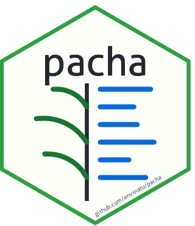

<!-- badges: start -->

[](https://lifecycle.r-lib.org/articles/stages.html#experimental) [](https://CRAN.R-project.org/package=pacha) [](https://github.com/envinatu/pacha/actions/workflows/R-CMD-check.yaml) [](https://cran.r-project.org/package=pacha) [](https://app.codecov.io/gh/envinatu/pacha)

<!-- badges: end -->

# pacha



`pacha` is an R package designed to query and report on taxonomic and ethnobotanical checklist data. It provides functions to query the 'Listado de plantas de uso y aprovechamiento sostenible en Ecuador' checklist ([doi:10.48580/dgvrn](https://doi.org/10.48580/dgvrn))—retrieved via ChecklistBank or a local Catalogue of Life Data Package (ColDP) archive—and generates Markdown reports for reproducible workflows. Built on the flexible ColDP schema, the package can be pointed at any ChecklistBank-compatible dataset beyond the Ecuador checklist, complete with support for extensible language dictionaries.


All user-facing results default to Spanish; language dictionaries are read dynamically from `inst/lang/*.yml`, so adding a language is a matter of dropping in a new file rather than changing code — set your language with `pacha_configure()`.

Query functions (`common_names_pacha()`, `establishment_pacha()`, `sustainable_uses_pacha()`, `threat_status_pacha()`, `reference_pacha()`, `is_listed()`, `pacha_sc_full_name()`, `compare_pacha()`) return plain data/text. Markdown-formatted reports for direct inclusion in documents are produced by `pacha_report()`.

## Installation

<!--
Install the stable version from CRAN:

``` r
install.packages("pacha")
```
-->

Install the latest development version from GitHub:

``` r
install.packages("pak")
pak::pkg_install("envinatu/pacha")
```

## Quick start

``` r
library(pacha)
```

Resolve the accepted scientific name:

``` r
pacha_sc_full_name("Bidens andicola")
```

Check whether the species is present in the checklist. Setting `detailed = TRUE` additionally returns its sustainable-use records:

``` r
is_listed("Bidens andicola")
is_listed("Bidens andicola", detailed = TRUE)
```

Retrieve individual pieces of information about the species, such as common names and establishment status:

``` r
common_names_pacha("Bidens andicola")
establishment_pacha("Bidens andicola")
sustainable_uses_pacha("Bidens andicola", use = "medicinal")
```

Generate a single Markdown block combining the scientific name, common names, and sustainable uses, ready to be inserted into a Quarto or R Markdown document:

``` r
pacha_report("Bidens andicola")
```

Retrieve the citation for the dataset:

``` r
reference_pacha()
```


`pacha_configure()` also exposes `language` (see above), `fetcher` (swap the underlying HTTP client, e.g. for testing or caching), `use_exclude_pattern` and `labels` (control which taxa/fields are filtered or how they're labelled), `source` and `timeout` (network request timeout). See `?pacha_configure` for the full argument reference.

Contributions that generalize dataset-specific assumptions, add wrappers to the `indexation_urls_pacha()` family for other indices, or expand `inst/lang/*.yml` with new languages are very welcome — see [CONTRIBUTING.md](CONTRIBUTING.md).

## Data sources and attribution

The package is a query client and does not redistribute underlying datasets. Users are responsible for complying with source licenses, terms of use, and proper citation requirements for any dataset queried through `pacha`. Results may vary or change as remote services and underlying data sources are updated.

## Code of Conduct

Please note that the pacha project is released with a [Contributor Code of Conduct](https://contributor-covenant.org/version/2/1/CODE_OF_CONDUCT.html). By contributing to this project, you agree to abide by its terms.
